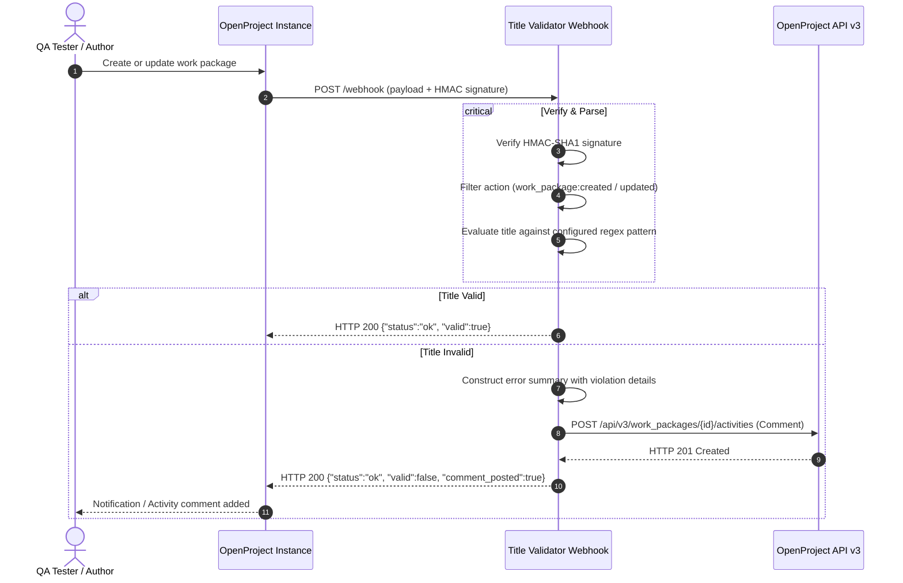
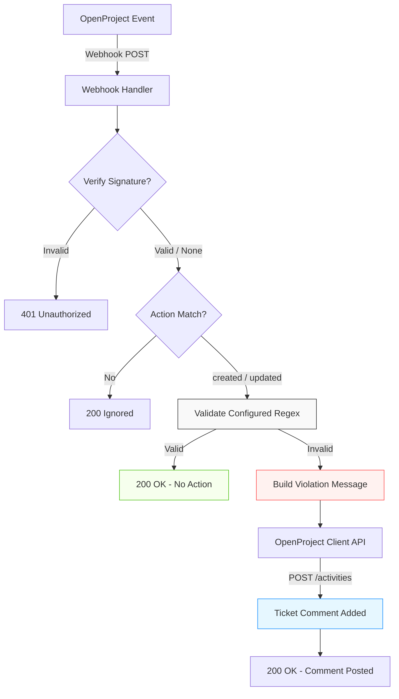

# OpenProject Title Validator Webhook

[](https://golang.org)
[](https://www.docker.com)
[](https://sonarqube.org)
[](https://www.openproject.org)

A lightweight, automated webhook integration service built in Go that verifies OpenProject work package (ticket) titles against standardized test case naming conventions. When a title does not adhere to the required criteria, the service automatically posts an actionable notification comment mentioning the author on the ticket.

---

## Title Specification

By default, every work package subject must strictly match the following 4-segment bracket format:

```text
[NOMOR TEST CASE][NAMA FEATURE][SUB FEATURE][PIC TESTER]
```

### Segment Breakdown

| Segment | Format Rule | Description | Example |
|---|---|---|---|
| `[NOMOR TEST CASE]` | `[TC-NNN]` | Must start with `TC-` followed by at least 3 digits | `[TC-001]`, `[TC-1234]` |
| `[NAMA FEATURE]` | `[Non-empty text]` | Main module or functional area | `[Authentication]` |
| `[SUB FEATURE]` | `[Non-empty text]` | Specific sub-module, component, or scenario | `[Password Reset Form]` |
| `[PIC TESTER]` | `[Non-empty text]` | Assigned Quality Assurance / Tester name | `[Ahmad Fais]` |

> [!TIP]
> The validation criteria, regex pattern, and comment notification template are fully configurable via environment variables (`TITLE_PATTERN`, `TITLE_CRITERIA_DESC`, and `COMMENT_TEMPLATE`).

### Examples

#### Valid Titles
- `[TC-001][Authentication][Login Form Validation][Ahmad]`
- `[TC-042][Billing][Stripe Webhook Processing][Budi]`
- `[TC-1205][Dashboard][Export Data Table to CSV][Siti]`

#### Invalid Titles
- `Fix login validation error` *(Missing brackets and required segments)*
- `[TC-01][Login][Form Validation][Ahmad]` *(TC number must be at least 3 digits: `TC-001`)*
- `[TC001][Login][Form Validation][Ahmad]` *(Missing hyphen after TC)*
- `[TC-001][Login][][Ahmad]` *(Empty sub feature bracket)*
- `[TC-001][Login][Form Validation][Ahmad] - urgent` *(Contains trailing characters outside brackets)*

---

## Automated Notification Format

When a ticket fails validation, a comment is automatically posted tagging the author:

> @**Ahmad**, judul tiket ini tidak sesuai dengan kriteria **[TC-NNN][NAMA FEATURE][SUB FEATURE][PIC TESTER]**! Harap perbarui judul tiket ini!
>
> **Detail pelanggaran:**
> - NOMOR TEST CASE harus berformat TC-NNN (contoh: TC-001), ditemukan: TC-01

---

## Getting Started

### Prerequisites

- [Go 1.23+](https://golang.org/dl/) (for local compilation)
- [Docker](https://docs.docker.com/get-docker/) & [Docker Compose](https://docs.docker.com/compose/) (recommended for containerized deployment)
- Administrative or webhook configuration access to an OpenProject instance

### Configuration

Create your environment configuration by copying `.env.example`:

```bash
cp .env.example .env
```

| Parameter | Required | Default | Description |
|---|:---:|:---:|---|
| `OPENPROJECT_URL` | Yes | - | Base URL of the OpenProject instance (e.g., `https://openproject.example.com` or `http://openproject:8080`) |
| `OPENPROJECT_API_KEY` | Yes | - | API access token for authenticating OpenProject API v3 requests |
| `WEBHOOK_SECRET` | No | - | Shared secret key for HMAC-SHA1 signature verification |
| `PORT` | No | `8080` | HTTP port on which the service listens |
| `TITLE_PATTERN` | No | `^\[TC-\d{3,}\]\[[^\[\]]+\]\[[^\[\]]+\]\[[^\[\]]+\]$` | Custom regex pattern for validating ticket titles |
| `TITLE_CRITERIA_DESC` | No | `[TC-NNN][NAMA FEATURE][SUB FEATURE][PIC TESTER]` | Human-readable criteria description used in comment notifications |
| `COMMENT_TEMPLATE` | No | `@{author}, judul tiket ini tidak sesuai dengan kriteria **{criteria}**! Harap perbarui judul tiket ini!` | Comment notification template (supports `{author}`, `{criteria}`, `{violations}`) |

> [!TIP]
> **Generating an OpenProject API Token:**
> 1. Log in to your OpenProject instance.
> 2. Navigate to **My Account** (`/my/account`) → **Access Token**.
> 3. Click **Generate** under the **API** section and copy the generated token into `OPENPROJECT_API_KEY`.

---

## OpenProject Webhook Setup

1. In OpenProject, go to **Administration** → **Integrations** → **Webhooks**.
2. Click **+ Webhook**.
3. Configure the webhook parameters:
   - **Payload URL**: `http://op-title-validator:8080/webhook` (intra-container) or `https://your-domain.com/webhook`
   - **Events**:
     - `Work packages` → Check **Created**
     - `Work packages` → Check **Updated**
   - **Secret**: *(Optional)* Enter a shared secret and set the same value in `WEBHOOK_SECRET`.
4. Click **Save**.

> [!IMPORTANT]
> When deployed in intra-container mode with Docker Compose, ensure OpenProject and the validator share the same Docker network (`openproject-net`).

---

## Deployment

### Option 1: Docker Compose (Intra-Container Mode)

The default `docker-compose.yml` is configured for secure intra-container communication on the `openproject-net` bridge network without exposing ports to the host:

```bash
# Start service in detached mode
docker compose up -d

# View real-time logs
docker compose logs -f
```

### Option 2: Docker CLI

```bash
# Create shared network if not exists
docker network create openproject-net

# Run container attached to network
docker run -d \
  --name op-title-validator \
  --network openproject-net \
  --restart unless-stopped \
  --env-file .env \
  ghcr.io/khw315/openproject-title-validator:latest
```

### Option 3: Standalone Binary

```bash
# Compile binary
go build -ldflags="-s -w" -o title-validator .

# Run application
./title-validator
```

---

## API Reference

### Health Check

```http
GET /health
```

#### Response (`200 OK`)
```json
{
  "status": "healthy"
}
```

---

### Webhook Ingestion

```http
POST /webhook
Content-Type: application/json
X-OP-Signature: sha1=<hmac-hash>
```

#### Responses
- `200 OK` — Valid title or ignored event:
  ```json
  {"status":"ok","valid":true}
  ```
- `200 OK` — Invalid title processed and comment posted:
  ```json
  {"status":"ok","valid":false,"comment_posted":true}
  ```
- `400 Bad Request` — Missing or malformed payload.
- `401 Unauthorized` — HMAC signature validation failure.
- `500 Internal Server Error` — OpenProject API communication failure.

---

## Testing & Quality Assurance

### Run Unit Tests

```bash
go test -v ./...
```

### Generate Coverage Report

```bash
go test -v -coverprofile=coverage.out ./...
go tool cover -func=coverage.out
```

### Static Analysis

```bash
go vet ./...
golangci-lint run
```

---

## CI/CD Pipeline

The project includes pre-configured GitHub Actions workflows:

| Workflow | File | Trigger | Description |
|---|---|---|---|
| **Go CI** | [golint.yml](.github/workflows/golint.yml) | Push & PR to branches | Runs `go vet`, dependency checks, unit tests, and `golangci-lint`. |
| **Build & Sonar** | [build.yml](.github/workflows/build.yml) | Push to `main`, `master`, `dev` | Runs full test suites with coverage and triggers SonarQube code analysis. |
| **Publish Docker** | [docker_push.yml](.github/workflows/docker_push.yml) | Tag `v*` or `dev*` | Builds multi-arch (`amd64`, `arm64`) Docker images and pushes to GitHub Container Registry (GHCR). |

---

## Architecture & Workflow

<details>
<summary><b>Click to expand Architecture & Workflow Diagrams</b></summary>

<br>

The diagrams below illustrate the end-to-end verification and feedback loop between OpenProject and the validator service.

### Sequence Diagram



### Component Flowchart



</details>
